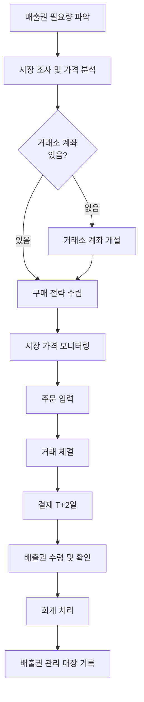

# 프로세스 문서 작성 템플릿

**우선순위**: ⭐⭐⭐ 최우선
**목표 개수**: 5개 주요 프로세스
**소요 시간**: 프로세스당 1-2시간

---

## 📝 작성 가이드

### 프로세스 문서의 중요성
- AI 챗봇이 절차 질문에 단계별로 답변하기 위해 필수
- Mermaid 다이어그램으로 자동 시각화 가능
- 사용자가 가장 자주 묻는 "어떻게 하나요?" 질문에 대응

### 작성 원칙
1. **단계별 명확성**: 각 단계를 명확히 구분
2. **완전성**: 시작부터 끝까지 모든 단계 포함
3. **실용성**: 실제 실행 가능한 구체적 지침
4. **시각화**: 플로우차트로 표현 가능하도록 구조화

---

## 📊 프로세스 템플릿

### 프로세스 #1: 배출권 구매 프로세스

---

#### 기본 정보

**프로세스명**: 배출권 구매 프로세스
**소요 시간**: 약 5-10 영업일
**담당자**: 환경/재무 담당자
**난이도**: ⭐⭐ 중급
**선행 요구사항**: 거래소 계좌 개설 완료

---

#### 프로세스 개요

배출권 부족 기업이 한국거래소를 통해 배출권을 구매하는 전체 프로세스입니다.
구매 의사결정부터 배출권 수령까지의 모든 단계를 포함합니다.

---

#### 전체 플로우



---

#### 상세 단계

##### 1단계: 배출권 필요량 파악

**목적**: 구매해야 할 배출권 수량 결정

**세부 작업**:
1. 전년도 실제 배출량 확인
2. 올해 할당받은 배출권 수량 확인
3. 부족량 계산
   ```
   필요량 = 예상 배출량 - 보유 배출권
   ```
4. 안전 재고 고려 (10-20% 추가)

**필요 정보**:
- 전년도 배출량 데이터
- 배출권 할당 통지서
- 올해 생산 계획

**소요 시간**: 1-2일

**체크리스트**:
- [ ] 실제 배출량 데이터 확인
- [ ] 할당 배출권 수량 확인
- [ ] 부족량 계산 완료
- [ ] 안전 재고 고려

**주의사항**:
- 배출량은 계절에 따라 변동 가능
- 생산량 증가 계획 반영 필요

---

##### 2단계: 시장 조사 및 가격 분석

**목적**: 적정 구매 가격 결정

**세부 작업**:
1. 현재 시장 가격 확인
   - 한국거래소 배출권 시장 웹사이트
   - 최근 1개월 가격 추이 분석
2. 가격 예측
   - 계절적 요인 (여름/겨울 수요 증가)
   - 규제 변화 영향
   - 공급량 변화
3. 구매 시기 결정
   - 가격이 낮은 시기 선택
   - 긴급성 고려

**필요 정보**:
- 거래소 시장 가격 데이터
- 시장 동향 보고서
- 전문가 의견

**소요 시간**: 2-3일

**체크리스트**:
- [ ] 현재 시장 가격 확인
- [ ] 가격 추이 분석 완료
- [ ] 목표 구매 가격 설정
- [ ] 구매 시기 결정

**주의사항**:
- 제출 기한(6월 30일) 임박 시 가격 급등 가능
- 너무 낮은 가격만 고집하면 구매 실패 가능

---

##### 3단계: 거래소 계좌 개설 (신규 고객만)

**목적**: 배출권 거래를 위한 계좌 개설

**세부 작업**:
1. 필요 서류 준비
   - 사업자등록증 사본
   - 법인 인감증명서
   - 대표이사 신분증 사본
   - 계좌 개설 신청서
2. 온라인 신청
   - 한국거래소 웹사이트 접속
   - 회원 가입 및 신청서 작성
3. 서류 제출
   - 우편 또는 방문 제출
4. 승인 대기
   - 3-5 영업일 소요

**필요 정보**:
- 회사 정보
- 담당자 연락처

**소요 시간**: 5-7 영업일

**체크리스트**:
- [ ] 필요 서류 준비 완료
- [ ] 온라인 신청 완료
- [ ] 서류 제출 완료
- [ ] 승인 확인

**주의사항**:
- 서류 미비 시 승인 지연
- 담당자 연락처 정확히 기재

---

##### 4단계: 구매 전략 수립

**목적**: 최적의 구매 방법 결정

**세부 작업**:
1. 구매 방식 선택
   - 시장가 주문: 즉시 체결 (긴급 시)
   - 지정가 주문: 원하는 가격 설정 (여유 있을 때)
2. 주문 수량 분할 여부
   - 한 번에 대량 구매 vs 분할 구매
   - 분할 구매 시 가격 변동 리스크 완화
3. 구매 시점 선택
   - 시장 개장 시간 (09:00-15:30)
   - 가격이 낮은 시점 포착

**필요 정보**:
- 시장 가격 동향
- 구매 긴급도

**소요 시간**: 반나절

**체크리스트**:
- [ ] 주문 방식 결정
- [ ] 주문 수량 분할 계획
- [ ] 구매 시점 선택

**주의사항**:
- 대량 주문 시 시장 가격 영향 가능
- 분할 구매 시 평균 단가 고려

---

##### 5단계: 시장 가격 모니터링

**목적**: 최적 매수 시점 포착

**세부 작업**:
1. 실시간 가격 확인
   - 거래소 웹사이트 또는 HTS
2. 호가 창 확인
   - 매수/매도 호가
   - 체결 가능 수량
3. 매수 시점 결정
   - 목표 가격 도달 시
   - 또는 긴급 시 즉시 매수

**필요 정보**:
- 실시간 시장 데이터

**소요 시간**: 지속적 (주문 전까지)

**체크리스트**:
- [ ] 실시간 가격 확인
- [ ] 호가 창 분석
- [ ] 매수 시점 결정

---

##### 6단계: 주문 입력

**목적**: 거래소 시스템에 매수 주문 등록

**세부 작업**:
1. 거래소 시스템 로그인
2. 주문 정보 입력
   - 주문 유형: 매수
   - 가격 유형: 시장가 or 지정가
   - 수량: 구매할 배출권 톤수
   - 가격: (지정가인 경우) 원/톤
3. 주문 확인 및 제출
4. 주문 번호 기록

**필요 정보**:
- 계좌 정보
- 주문 내용

**소요 시간**: 10-20분

**체크리스트**:
- [ ] 시스템 로그인
- [ ] 주문 정보 정확히 입력
- [ ] 주문 제출 완료
- [ ] 주문 번호 기록

**주의사항**:
- 수량 단위 확인 (톤)
- 가격 단위 확인 (원/톤)
- 오입력 주의

---

##### 7단계: 거래 체결

**목적**: 주문 체결 확인

**세부 작업**:
1. 체결 내역 확인
   - 체결 가격
   - 체결 수량
   - 체결 시간
2. 미체결 시 조치
   - 지정가 주문: 가격 조정 또는 대기
   - 긴급 시: 시장가로 변경
3. 체결 확인서 출력

**필요 정보**:
- 주문 번호

**소요 시간**: 즉시 ~ 수일 (주문 방식에 따라)

**체크리스트**:
- [ ] 체결 여부 확인
- [ ] 체결 내역 확인
- [ ] 체결 확인서 출력

**주의사항**:
- 시장가는 즉시 체결
- 지정가는 체결 안 될 수 있음

---

##### 8단계: 결제 (T+2일)

**목적**: 거래 대금 결제

**세부 작업**:
1. 결제일 확인
   - 거래 체결일로부터 2 영업일 후
2. 결제 금액 확인
   - 체결 금액 + 수수료
3. 계좌 잔액 확보
   - 결제일 전까지 계좌 입금
4. 자동 결제 진행
   - 거래소에서 자동 처리

**필요 정보**:
- 체결 내역
- 결제 금액

**소요 시간**: T+2일 자동 처리

**체크리스트**:
- [ ] 결제일 확인
- [ ] 결제 금액 확인
- [ ] 계좌 잔액 확보
- [ ] 결제 완료 확인

**주의사항**:
- 잔액 부족 시 거래 취소 및 제재
- 결제일 공휴일 시 익일 결제

---

##### 9단계: 배출권 수령 및 확인

**목적**: 배출권 정상 수령 확인

**세부 작업**:
1. 배출권 입고 확인
   - 거래소 계좌 또는 할당관리시스템
2. 수령 수량 확인
   - 체결 수량과 일치 여부
3. 문제 발생 시 거래소 문의

**필요 정보**:
- 체결 내역

**소요 시간**: T+2일 자동 입고

**체크리스트**:
- [ ] 배출권 입고 확인
- [ ] 수량 일치 확인
- [ ] 입고 내역 출력

---

##### 10단계: 회계 처리

**목적**: 배출권 구매 회계 기록

**세부 작업**:
1. 회계 분개
   ```
   차변: 무형자산(배출권) XXX원
   대변: 현금 XXX원
   ```
2. 증빙 서류 첨부
   - 체결 확인서
   - 세금계산서 (해당 시)
3. 회계 시스템 입력

**필요 정보**:
- 구매 금액
- 구매 수량
- 단가

**소요 시간**: 1-2시간

**체크리스트**:
- [ ] 회계 분개 작성
- [ ] 증빙 서류 첨부
- [ ] 회계 시스템 입력

**주의사항**:
- 부가세 면세 (영세율 아님)
- 취득원가 기준 평가

---

##### 11단계: 배출권 관리 대장 기록

**목적**: 배출권 이력 관리

**세부 작업**:
1. 관리 대장 작성
   - 구매일
   - 수량
   - 단가
   - 총액
   - 누적 보유량
2. 파일 정리
   - 체결 확인서
   - 입고 확인서
   - 회계 전표

**필요 정보**:
- 모든 거래 내역

**소요 시간**: 30분

**체크리스트**:
- [ ] 관리 대장 업데이트
- [ ] 파일 정리 완료
- [ ] 누적 보유량 확인

---

#### 전체 프로세스 요약

| 단계 | 주요 작업 | 소요 시간 | 담당자 |
|------|-----------|-----------|--------|
| 1 | 필요량 파악 | 1-2일 | 환경 담당자 |
| 2 | 시장 조사 | 2-3일 | 재무 담당자 |
| 3 | 계좌 개설 | 5-7일 | 환경 담당자 |
| 4 | 전략 수립 | 0.5일 | 재무 담당자 |
| 5 | 가격 모니터링 | 지속 | 재무 담당자 |
| 6 | 주문 입력 | 0.1일 | 재무 담당자 |
| 7 | 거래 체결 | 즉시 | 자동 |
| 8 | 결제 | T+2일 | 자동 |
| 9 | 수령 확인 | 즉시 | 환경 담당자 |
| 10 | 회계 처리 | 0.1일 | 회계 담당자 |
| 11 | 대장 기록 | 0.1일 | 환경 담당자 |

**총 소요 시간**: 약 9-13 영업일 (계좌 있는 경우 4-6일)

---

#### 필요 서류 체크리스트

**사전 준비**:
- [ ] 사업자등록증 (계좌 개설 시)
- [ ] 법인 인감증명서 (계좌 개설 시)
- [ ] 대표이사 신분증 (계좌 개설 시)

**거래 진행**:
- [ ] 배출량 데이터
- [ ] 할당 통지서
- [ ] 시장 가격 정보

**사후 정리**:
- [ ] 체결 확인서
- [ ] 입고 확인서
- [ ] 회계 전표

---

#### 자주 발생하는 문제 및 해결

**문제 1**: 계좌 개설 승인이 지연됨
- **원인**: 서류 미비
- **해결**: 담당자에게 문의하여 추가 서류 제출

**문제 2**: 지정가 주문이 체결되지 않음
- **원인**: 시장 가격이 목표가에 도달하지 않음
- **해결**: 가격 조정 또는 시장가로 변경

**문제 3**: 결제일에 잔액 부족
- **원인**: 자금 준비 미흡
- **해결**: 사전에 결제 금액 확인 및 자금 확보

**문제 4**: 구매한 배출권이 입고되지 않음
- **원인**: 시스템 오류
- **해결**: 거래소에 즉시 문의

---

#### 관련 프로세스

- **배출권 판매 프로세스**: 보유 배출권을 판매하는 절차
- **거래소 계좌 개설 프로세스**: 신규 계좌 개설 상세 절차
- **배출량 보고 프로세스**: 연간 배출량 보고 절차

---

#### 참고 자료

- 한국거래소 배출권 시장: https://ets.krx.co.kr
- 온실가스종합정보센터: https://www.gir.go.kr
- 배출권 거래제 법령: 온실가스 배출권의 할당 및 거래에 관한 법률

---

#### 문의처

**한국거래소 배출권 시장**
- 전화: 02-3774-9000
- 이메일: ets@krx.co.kr

**후시파트너스 고객센터**
- 전화: [전화번호]
- 이메일: [이메일]

---

### 프로세스 #2-5 (직접 작성)

다음 프로세스를 동일한 형식으로 작성해주세요:

1. **배출권 판매 프로세스**
2. **배출량 보고 프로세스**
3. **ESG 보고서 작성 프로세스**
4. **배출권 생성 프로세스 (외부사업)**

---

## 📋 프로세스 작성 체크리스트

### 필수 포함 사항
- [ ] 프로세스 기본 정보 (이름, 소요시간, 담당자)
- [ ] 전체 플로우 다이어그램 (Mermaid)
- [ ] 단계별 상세 설명 (최소 5단계)
- [ ] 각 단계별 체크리스트
- [ ] 주의사항 및 문제 해결
- [ ] 필요 서류 목록
- [ ] 관련 프로세스 링크

### 품질 확인
- [ ] 시작부터 끝까지 모든 단계 포함
- [ ] 각 단계가 명확히 구분됨
- [ ] 실행 가능한 구체적 지침
- [ ] Mermaid 다이어그램이 프로세스 반영

---

## 💡 작성 팁

### 1. 플로우차트 작성
- 시작과 끝이 명확해야 함
- 의사결정 지점(분기) 명시
- 너무 복잡하지 않게 (10-15 노드)

### 2. 단계별 설명
- 목적 → 세부작업 → 체크리스트 순서
- 구체적인 행동 동사 사용
- 예상 소요 시간 명시

### 3. 주의사항
- 실제로 자주 발생하는 문제
- 간과하기 쉬운 포인트
- 시간/비용이 추가되는 경우

---

**작성 완료일**: [날짜]
**작성자**: [이름]
**검토자**: [이름]
